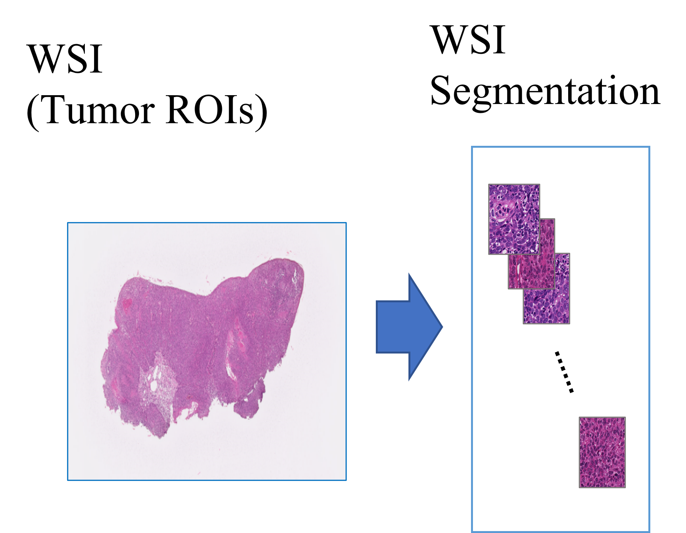
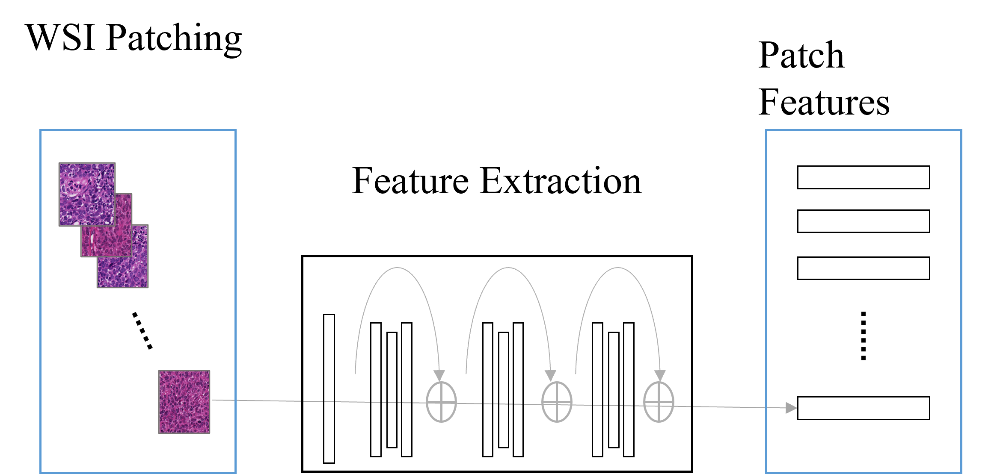
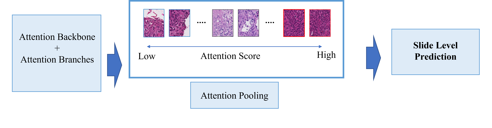

**Our Code is modified from the following Git hub**

*CLAM architecture https://github.com/mahmoodlab/CLAM*

*CycleGAN architecture https://github.com/ayukat1016/gan_sample/tree/main/chapter5*


### Pre-requisites:
* Linux (Tested on Ubuntu 20.04)
* NVIDIA GPU (Tested on Nvidia A100)

## CLAM with Annotation 

Prepare the environment for CLAM    
The installation guide are written in the GITHUB of [mahmoodlab](https://github.com/mahmoodlab/CLAM/blob/master/docs/INSTALLATION.md/)

### Prepare
1. Make annotation using QuPath [QuPath](https://qupath.github.io/)  
2. Export Object Data as geojson (Pretty JSON)  
   Note: Check the feature geometry type is exported as Polygon (Our code does not support the Mutlipolygon)
3. Make folder "ANN_PATH" and add annotation data(.geojson) to the folder  
   Note: The file name of the annotation data should be the same as the WSI file.  
         (ex. slide_1.ndpi & slide_1.geojson)


### WSI Segmentation and Make Patch 


The first step focuses on segmenting the tissue.  
The segmentation of the annotated area on the slides.  
Place the digitized whole slide image data (formated .ndpi, .svs etc.) under a folder named DATA_DIRECTORY

```bash
DATA_DIRECTORY/
	├── slide_1.ndpi
	├── slide_2.ndpi
	:	
	└── slide_X.ndpi
```

#### Run
``` shell
python create_patches_fp.py --source DATA_DIRECTORY --save_dir RESULTS_DIRECTORY --patch_size 256 --step_size 256 --seg --patch --stitch  --ann_path  ANN_DIR

```

The above command segment the slide in DATA_DIRECTORY using annotated ROIs.
The result (masks, patches,stitches and process_list_autogen.csv) is created at the following folder structure under RESULTS_DIRECTORY

```bash
RESULTS_DIRECTORY/
	├── masks
    		├── slide_1.png
    		├── slide_2.png
		:	:
    		└── slide_x.png
	├── patches
    		├── slide_1.h5
    		├── slide_2.h5
    		:	:
		└── slide_x.h5
	├── stitches
    		├── slide_1.png
    		├── slide_2.png
		:	:
    		└── slide_x.png
	└── process_list_autogen.csv

```

Check the **stitches** folder.   
It contains downsampled visualizations of stitched tissue patches (one image per slide)

In our model, we do not use information of MASK.  
Mask is created based on the CLAM preset.   
We use annotation information instead of MASK information.

### Feature Extraction (GPU Example)


Move "process_list_autogen.csv" (Created above under the RESULT_DIRECTORY) to main directory (current directory)

#### RUN
```bash
CUDA_VISIBLE_DEVICES=0,1 python extract_features_fp.py --data_h5_dir DIR_TO_COORDS --data_slide_dir DATA_DIRECTORY --csv_path CSV_FILE_NAME --feat_dir FEATURES_DIRECTORY --batch_size 512 --slide_ext .ndpi
```

The result (h5_files and pt_files) is created at the following folder structure under FEATURES_DIRECTORY

```bash
FEATURES_DIRECTORY/
    ├── h5_files
            ├── slide_1.h5
            ├── slide_2.h5
	    :	   :
            └── slide_x.h5
    └── pt_files
            ├── slide_1.pt
            ├── slide_2.pt
	    :	   :
            └── slide_x.pt
```


### Create Datasets and Train-Val-Test split
1. Create folder named "tumor_vs_normal_resnet_features" under DATA_ROOT_DIR     
2. Move the folde created by feature extraction (h5_files & pt_files) to the folder "tumor_vs_normal_resnet_features"    

The data used for training and testing are expected to be organized as follows:
```bash
DATA_ROOT_DIR/
    ├──tumor_vs_normal_resnet_features/
        ├── h5_files
                ├── slide_1.h5
                ├── slide_2.h5
		:	:
                └── slide_x.h5
        └── pt_files
                ├── slide_1.pt
                ├── slide_2.pt
		:	:
                └── slide_x.pt
```

3. Make a dictionary with slide name and label. Edit "tumor_vs_normal_dummy_clean.csv" at dataset_csv    
4. Run the command below (ex. Number of fold:10, train/val/test 80/10/10)

``` shell
python create_splits_seq.py --task task_1_tumor_vs_normal --seed 1 --label_frac 1.0 --k 10 　
```

### Training


For trining using training data      
#### Run the command below
``` shell
CUDA_VISIBLE_DEVICES=0 python main.py --drop_out --early_stopping --lr 2e-4 --k 10 --label_frac 0.5 --exp_code task_1_tumor_vs_normal_CLAM_50 --weighted_sample --bag_loss ce --inst_loss svm --task task_1_tumor_vs_normal --model_type clam_sb --log_data --data_root_dir DATA_ROOT_DIR
```

### Test
For test the data using test data 
#### Run the command below
``` shell
CUDA_VISIBLE_DEVICES=0 python eval.py --drop_out --k 10 --models_exp_code task_1_tumor_vs_normal_CLAM_100_s1 --save_exp_code task_1_tumor_vs_normal_CLAM_100_s1_cv --task task_1_tumor_vs_normal --model_type clam_sb --results_dir results --data_root_dir DATA_ROOT_DIR
```

### Heatmap Visualization  
1. Create a tumor_vs_normal_dummy.csv file with case IDs for heatmap generation.   
   Place the file at heatmaps/process_lists
2. Save WSIs (.ndpi, .svs etc) at heatmaps/demo/slides    
3. Save chekpoint file (___checkpoint.pt) at heatmaps/demo/ckpts   
   Checkpoint files are created at results folder after training   
4. Change the config_template.yaml (@ heatmaps/configs) : Specify the checkpoint file name
5. Change the h5 and pt file path at create_heatmaps.py line 283 and 284    
   the path is H5 and PT files folder "DATA_ROOT_DIR/tumor_vs_normal_resnet_features/"

#### Run the command below
``` shell
CUDA_VISIBLE_DEVICES=0,1 python create_heatmaps.py --config config_template.yaml
```
The result is created under heatmaps directory

The heat map using annotated area is created under heatmap_row result


## License
This code is made available under the GPLv3 License and is available for non-commercial academic purposes.

## Reference
This Github is forked from  * https://github.com/mahmoodlab/CLAM*
We referenced below     
Lu, M.Y., Williamson, D.F.K., Chen, T.Y. et al. Data-efficient and weakly supervised computational pathology on whole-slide images. Nat Biomed Eng 5, 555–570 (2021). https://doi.org/10.1038/s41551-020-00682-w


## CycleGAN for patches

Prepare the environment for GAN    
We tested the GAN under the environment of GAN.yaml(at docs folder)

### Prepare     
1. Save the patch-images you want to use at the folder (train/A or train/B)    
2. Check the parameter of Cycle_GAN.py       
   a) line 30,31       Check correct data path name     
   b) lines 196-209    Set the parametor for training     
   c) lines 404-416    Set the parametor for test     
   d) line  462        Set the number of images to create      


#### Run the command below
``` shell
python Cycle_GAN.py   
```

If you want to create images from the image which you donot use for training, try to use cyclegan_test.py after setting the parametors.


## License
This code is made available under the GPLv3 License and is available for non-commercial academic purposes.

## Reference
This Github is modified from the codes at https://github.com/ayukat1016/gan_sample
